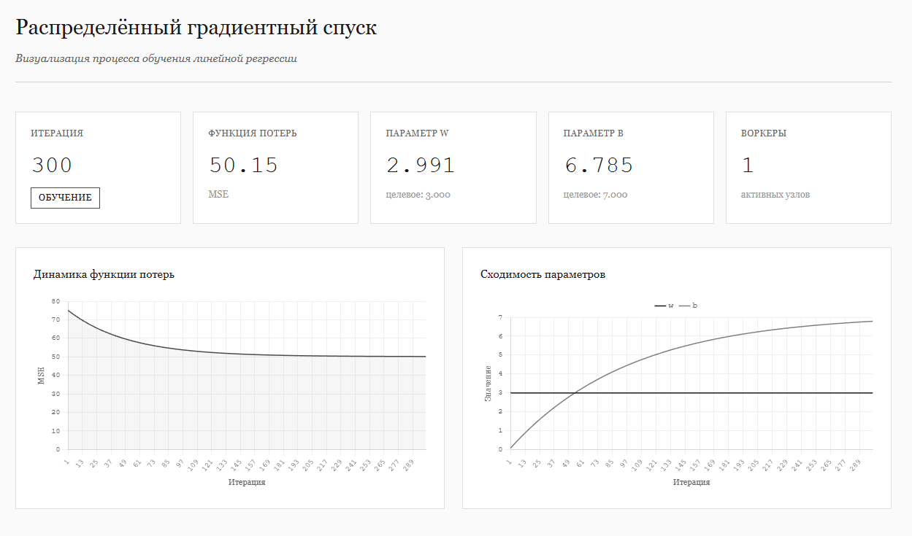

# Распределённый градиентный спуск

Реализация распределённой системы обучения линейной регрессии методом градиентного спуска. Цель проекта - практика в создании масштабируемых приложений с kubernetes, docker, применение лучших практик. 

Превью страницы:



## Описание

Система состоит из координатора и множества воркеров, которые параллельно вычисляют градиенты на разных частях датасета. Координатор агрегирует результаты и обновляет параметры модели. Веб-интерфейс показывает процесс обучения в реальном времени.

### Задача

Линейная регрессия с распределённым градиентным спуском:

**Модель:**

$$y = w \cdot x + b + \varepsilon, \quad \varepsilon \sim \mathcal{N}(0, \sigma^2)$$

**Функция потерь:**

$$\mathcal{L}(w, b) = \frac{1}{2n} \sum_{i=1}^{n} (y_i - (w \cdot x_i + b))^2$$

**Градиенты:**

$$\nabla_w \mathcal{L} = \frac{1}{n} \sum_{i=1}^{n} (w \cdot x_i + b - y_i) \cdot x_i$$

$$\nabla_b \mathcal{L} = \frac{1}{n} \sum_{i=1}^{n} (w \cdot x_i + b - y_i)$$

**Обновление параметров:**

$$\theta_{t+1} = \theta_t - \alpha \cdot \nabla \mathcal{L}(\theta_t)$$

где $w \approx 3.0$, $b \approx 7.0$ - истинные параметры, $\alpha = 0.01$ - шаг обучения.

**Распределённая агрегация:**

Каждый воркер вычисляет градиент на своём чанке данных $D_k$, координатор агрегирует:

$$\nabla \mathcal{L} = \frac{1}{|D|} \sum_{k=1}^{K} |D_k| \cdot \nabla \mathcal{L}_k$$

### Архитектура

```
Coordinator
├── Генерирует синтетические данные (10000 точек)
├── Распределяет данные между воркерами
├── Собирает градиенты от воркеров
├── Агрегирует через weighted average
├── Обновляет параметры модели
└── Экспортирует метрики для визуализации

Worker (N экземпляров)
├── Регистрируется у координатора
├── Получает свой chunk данных
├── Вычисляет градиенты локально
├── Отправляет результаты координатору
└── Измеряет время вычислений

Web Interface
├── Запрашивает метрики через REST API
├── Отображает loss и параметры в реальном времени
└── Обновляется каждые 500ms
```


### Локальный запуск

```bash
# Установить зависимости
pip install -r requirements.txt

# Терминал 1: Coordinator
python coordinator/server.py

# Терминалы 2-4: Workers
python worker/worker.py worker-1
python worker/worker.py worker-2
python worker/worker.py worker-3

# Открыть viewer/index.html в браузере
```

### Запуск через Docker

```bash
# Собрать и запустить все сервисы
docker-compose up --build

# Масштабировать воркеры
docker-compose up --scale worker=5

# Открыть http://localhost:8080
```

### Kubernetes deployment

```bash
# Развернуть в кластере
kubectl apply -f deploy/k8s/base/

# Проверить статус
kubectl get pods -n gradient-descent

# Масштабировать воркеры
kubectl scale deployment worker --replicas=5 -n gradient-descent

# Получить URL веб-интерфейса
kubectl get service viewer -n gradient-descent
```

## Структура проекта

```
distributed-gradient-descent/
│
├── coordinator/
│   ├── server.py              # FastAPI сервер координатора
│   ├── internal/
│   │   ├── aggregator/        # Агрегация градиентов
│   │   ├── dataset/           # Генерация и разбиение данных
│   │   └── metrics/           # Prometheus метрики
│   └── Dockerfile
│
├── worker/
│   ├── worker.py              # Асинхронный воркер
│   ├── internal/
│   │   ├── gradient/          # Вычисление градиентов
│   │   └── metrics/           # Экспорт метрик
│   └── Dockerfile
│
├── viewer/
│   ├── index.html             # Веб-интерфейс
│   └── Dockerfile
│
├── deploy/
│   ├── docker-compose.yaml    # Локальный запуск через Docker
│   └── k8s/
│       ├── base/              # Базовые манифесты
│       ├── networking/        # NetworkPolicy, Service
│       ├── resilience/        # PDB, resource limits
│       ├── autoscaling/       # HPA
│       └── observability/     # Prometheus, Grafana
│
├── requirements.txt
└── README.md
```

## API

### Эндпоинты координатора'

```
GET  /health
     Проверка состояния сервиса

POST /api/register
     Регистрация воркера и получение chunk данных
     Body: {"worker_id": "worker-1"}
     Response: {"worker_id": "...", "X": [...], "y": [...], "chunk_size": 3333}

GET  /api/params
     Получение текущих параметров модели
     Response: {"iteration": 42, "w": 2.965, "b": 4.893, "learning_rate": 0.01}

POST /api/gradient
     Отправка вычисленного градиента
     Body: {"worker_id": "...", "dw": -0.015, "db": -6.78, "n_samples": 3333, "compute_time": 0.001}

GET  /api/history
     Получение истории обучения для визуализации
     Response: {"history": {...}, "current_state": {...}}
```

## Мониторинг

Система экспортирует метрики в формате Prometheus:

- `gradient_descent_iteration` - текущая итерация обучения
- `gradient_descent_loss` - значение функции потерь
- `gradient_descent_param_w` - параметр w
- `gradient_descent_param_b` - параметр b
- `worker_compute_time_seconds` - время вычисления градиента
- `worker_gradient_magnitude` - норма градиента

Grafana дашборды находятся в `deploy/k8s/observability/dashboards/`.

## Отказоустойчивость

Система тестируется на устойчивость к отказам:

1. Падение одного воркера - обучение продолжается на оставшихся
2. Перезапуск координатора - воркеры переподключаются
3. Сетевые задержки - таймауты и retry логика
4. Resource limits - корректная работа под ограничениями CPU/memory

Эксперименты описаны в `deploy/k8s/resilience/experiments.md`.

## Масштабирование

HorizontalPodAutoscaler автоматически изменяет количество воркеров на основе:
- CPU utilization
- Средней задержки обработки градиента
- Размера очереди запросов

Конфигурация в `deploy/k8s/autoscaling/hpa.yaml`.

## Технологии

**Backend**
- Python 3.11
- FastAPI + Uvicorn
- NumPy для вычислений
- httpx для асинхронных HTTP запросов

**Frontend**
- HTML5, CSS3
- Chart.js для визуализации

**Infrastructure**
- Docker для контейнеризации
- Kubernetes для оркестрации
- Prometheus для метрик
- Grafana для дашбордов

## Производительность

Измерения на локальной машине (10000 samples, 100 iterations):

| Воркеры | Время обучения | Ускорение |
|---------|---------------|-----------|
| 1       | 42.3s         | 1.0x      |
| 2       | 22.1s         | 1.91x     |
| 4       | 11.8s         | 3.58x     |
| 8       | 6.9s          | 6.13x     |

Результаты в Kubernetes кластере зависят от сетевых задержек и ресурсов нод.

## Лицензия

MIT
